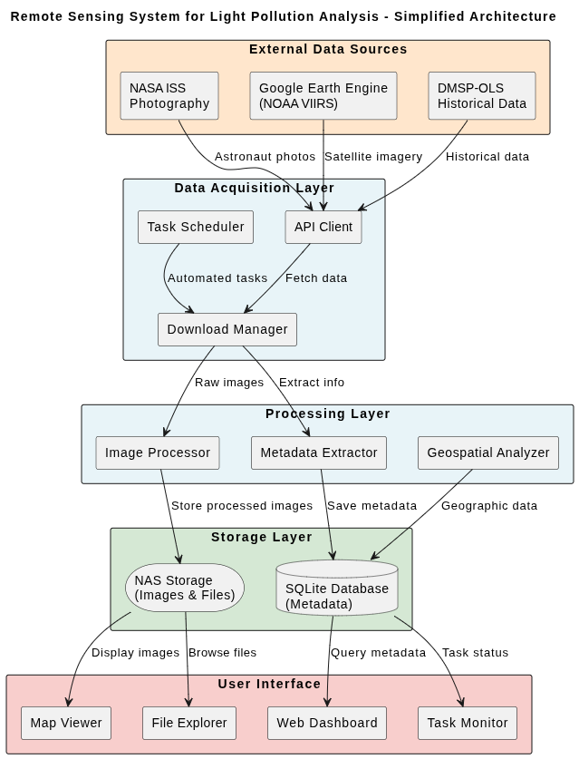
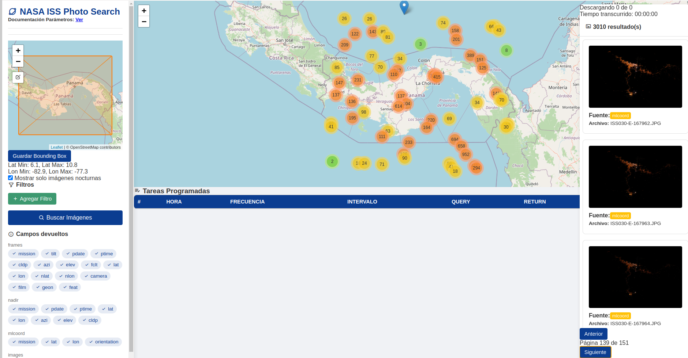
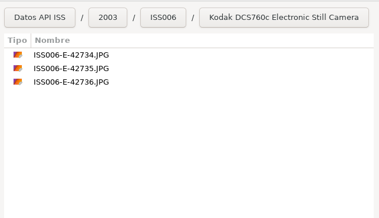
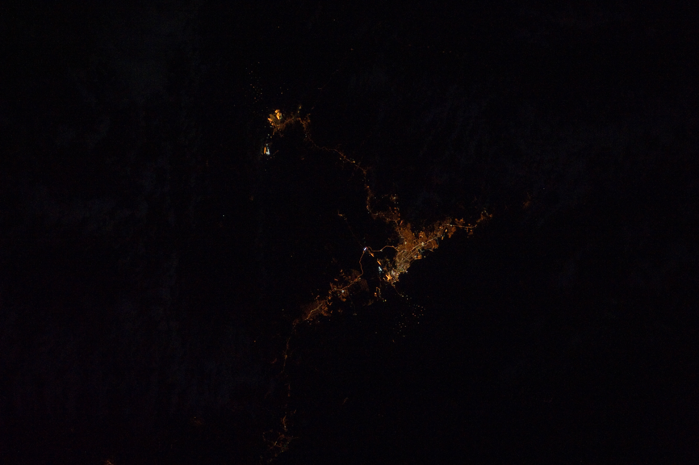
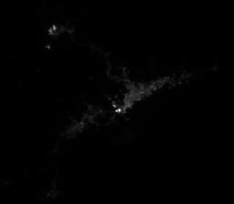
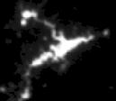

# Project Description


## Project Overview

TropicalALAN_Lab_PTY is a research and engineering group dedicated to advancing the understanding of artificial light at night (ALAN) in tropical environments. The team operates the first multi-station monitoring network across the Panama Canal Basin, integrating photometric, spectrometric, and remote-sensing datasets. The group develops open, interoperable software and automated hardware systems to quantify the environmental, atmospheric, biological, and economic implications of light pollution, including links with regional GDP/PIB.

## Overview

This system integrates NASA ISS, NOAA VIIRS, and DMSP-OLS satellite data sources into an automated repository. Features include API integration, Google Earth Engine access, scheduled downloads, and hierarchical file organization.

## Key Features

- **Multiple satellite sources**: NASA ISS, NOAA VIIRS, DMSP-OLS
- **Automated scheduled downloads**: Periodic data acquisition with configurable schedules
- **SQLite database**: Geospatial metadata management with structured schemas
- **Professional English interface**: Clean, internationalized UI with comprehensive documentation
- **Electron-based UI**: Interactive maps with Leaflet for data visualization
- **Scalable NAS storage**: Hierarchical file organization for large datasets
- **Google Earth Engine integration**: Satellite data access and collection
- **API integration**: NASA Photos Database and custom processing endpoints
- **Comprehensive logging**: Modular logging system with structured error reporting

## Project Architecture

```
Remote-sensing/
├── db/                              # Database layer
│   ├── Crud.py                      # Database CRUD operations
│   ├── Tables.py                    # Schema initialization
│   └── metadata.sql                 # SQL schema definitions
│
├── scripts/                         # Core processing modules
│   ├── backend/                     # API clients and processors
│   │   ├── nasa_api_client.py       # NASA API integration
│   │   ├── imageProcessor.py        # Image processing pipeline
│   │   └── task_api_client.py       # Task management API
│   ├── noaa/                        # Google Earth Engine module
│   │   ├── noaa_processor.py        # VIIRS/DMSP-OLS processing
│   │   └── ui/                      # NOAA visualization
│   ├── periodic_tasks/             # Scheduled tasks management
│   │   ├── tasks.json               # Task configuration
│   │   └── ui/                      # Task scheduler interface
│   └── utils/                       # Utility functions
│
├── logs/                            # System logs
│   ├── iss/                         # ISS module logs
│   └── noaa/                        # NOAA module logs
│
├── map/                             # Electron desktop application
│   ├── main.js                      # Main process
│   ├── config.js                    # Application configuration
│   └── menu.sh                      # System menu
│
├── requirements.txt                 # Python dependencies
├── package.json                     # Node.js dependencies
└── menu.sh                          # Main system launcher
```

## System Requirements

| Component | Requirement |
|-----------|-------------|
| **Operating System** | Windows 11 + WSL2 (Ubuntu 24.04) or Native Linux |
| **Python** | 3.8+ (3.10.12 recommended) |
| **Node.js** | 16+ LTS |
| **Package Manager** | npm 8+ |
| **External Tools** | aria2c, git, curl |
| **Credentials** | NASA API Key, Google Earth Engine credentials |
| **Language** | English interface (internationalization-ready) |

### Optional Dependencies
- Google Earth Engine CLI for advanced satellite processing
- NAS mount capabilities for centralized storage
- Modern web browser with JavaScript enabled for UI access

## Required APIs & Credentials Setup

Before starting the installation, you must obtain credentials for the following services:

### 1. NASA ISS Photo Database API

**Purpose**: Access astronaut photography from the International Space Station

**Documentation & Setup:**

Visit the complete API documentation: https://eol.jsc.nasa.gov/SearchPhotos/PhotosDatabaseAPI/

**API Key Requirements:**

- API keys are **free** and used to track and control API usage
- Email the NASA JSC Earth Observations Laboratory to request your API key
- Documentation: https://eol.jsc.nasa.gov/SearchPhotos/PhotosDatabaseAPI/
- Store the key in your `.env` file as `NASA_API_KEY`

**Response Format:**

- Items are returned as **JSON** format
- Supports both GET and POST request types

**Request Types:**

1. **GET Requests**: Arguments specified in the URL after a question mark (?)
   ```
   https://eol.jsc.nasa.gov/SearchPhotos/API/lookup?arguments=value&other=value
   ```
   - Arguments are separated by ampersands (&)
   - Format: variable=value pairs
   - Example: `https://some.web.path?vara=foo&varb=bar`

2. **POST Requests**: Arguments in the HTTP request body
   - Data formatted as variable=value pairs separated by ampersands (&)
   - Useful for complex queries with many parameters

**Query Requirements & Logic:**

- All specified query parameters must be satisfied (AND logic joins parameters)
- Multiple table specifications require records in each table (inner join)
- **Lowercase required** for: argument variable names, table names, field names, operators
- **Case-insensitive** for: query parameter values
- Field order in "return" argument does not affect JSON output order


**Supported Tools for Requests:**

- Web browsers (via direct URL)
- `curl` or `wget` command-line tools
- Custom scripts (Python, Node.js, etc.)
- Any software capable of making HTTP GET/POST requests

### 2. Google Earth Engine API (for NOAA VIIRS/DMSP-OLS)

**Purpose**: Access NOAA satellite data (VIIRS nighttime lights and DMSP-OLS archives) and perform large-scale geospatial processing

**Prerequisites:**
- Google Cloud account (create one at https://console.cloud.google.com/)
- Google Earth Engine access (request at https://earthengine.google.com/)

**Step-by-step setup:**

1. **Create Google Cloud Project**:
   - Go to https://console.cloud.google.com/
   - Click "Select a Project" → "New Project"
   - Name it (e.g., "Remote-Sensing-ALAN")
   - Click "Create"

2. **Enable Earth Engine API**:
   - In Cloud Console, search for "Earth Engine API"
   - Click on it and press "Enable"

3. **Create Service Account**:
   - Go to "APIs & Services" → "Credentials"
   - Click "Create Credentials" → "Service Account"
   - Fill in account details (name, description)
   - Click "Create and Continue"
   - Grant roles:
     - Select "Editor" role
     - Click "Continue" → "Done"

4. **Create & Download JSON Key**:
   - In Credentials page, find your service account
   - Click on it → "Keys" tab
   - Click "Add Key" → "Create new key"
   - Choose **JSON** format
   - Click "Create" (automatically downloads the key file)
   - Save this file to `scripts/noaa/credentials.json`

5. **Authenticate Google Earth Engine CLI** (alternative method):
   ```bash
   earthengine authenticate
   # This will open a browser window to authorize access
   # Follow the authorization prompts
   ```

6. **Register project for Earth Engine**:
   - Visit https://earthengine.google.com/signup/
   - Fill in the form with your project details
   - Wait for approval (usually within 24-48 hours)
   - Once approved, your service account will have Earth Engine access

**Environment Configuration:**

Store credentials in your `.env` file:
```env
# NASA API
NASA_API_KEY=your_api_key_here

# Google Earth Engine
GEE_SERVICE_ACCOUNT_JSON=scripts/noaa/credentials.json
GEE_PROJECT_ID=your-gcp-project-id
```

**Verify Setup:**
```bash
# Test NASA API (no auth required)
curl "https://images-api.nasa.gov/search?q=ISS&media_type=image"

# Test Google Earth Engine
earthengine authenticate
earthengine info
```

## Installation Guide

### Quick Setup (Automated)

```bash
# 1. Clone repository
git clone [repository-url] && cd Remote-sensing

# 2. Run automated setup
chmod +x setup.sh
./setup.sh
```

The setup script installs all dependencies automatically. After completion, follow the manual configuration steps in steps_setup.md.

### Prerequisites Before Installation

1. **NASA API Key** (required)
   - Get from: https://eol.jsc.nasa.gov/SearchPhotos/PhotosDatabaseAPI/
   - Wait for approval

2. **Google Earth Engine** (optional for NOAA module)
   - Setup: https://console.cloud.google.com/
   - Wait for approval

3. **Environment Configuration**
   ```bash
   cp .env.example .env
   # Edit .env with your credentials (see steps_setup.md for details)
   ```

### Manual Installation

If you prefer manual setup or automated setup fails, follow steps_setup.md section by section:
- Environment setup
- Database initialization  
- API credentials configuration
- NAS mounting (optional)
- Troubleshooting

## Usage Guide

### Main Menu

Launch the system through the main interface:

```bash
./menu.sh
```

This opens an interactive menu with four core modules:

### 1. ISS Search Module
- **Purpose**: Acquire ISS (International Space Station) imagery
- **Features**: 
  - API queries to NASA's ISS Photo Database
  - Automatic download and metadata extraction
  - Geospatial filtering
- **Usage**: Select "ISS Search" from main menu

### 2. NOAA Data Module
- **Purpose**: Collect NOAA satellite data (VIIRS, DMSP-OLS)
- **Features**:
   - Google Earth Engine integration
   - Automated data collection
   - Time-series data organization
- **Usage**: Select "NOAA Data" from main menu

### 3. Visual Explorer
- **Purpose**: Interactive data visualization and management
- **Features**:
  - File system navigation
  - Map-based visualization with Leaflet
  - Metadata browsing
  - Quick access to processed data
- **Usage**: Select "Visual Explorer" from main menu

### 4. Scheduled Tasks
- **Purpose**: Automate periodic data acquisition
- **Features**:
  - Customizable download schedules
  - Task monitoring and logs
  - Automatic error recovery
- **Usage**: Select "Scheduled Tasks" from main menu

## Configuration & Customization

### Key Configuration Files

| File | Purpose |
|------|---------|
| `scripts/periodic_tasks/tasks.json` | Scheduled task definitions |
| `scripts/noaa/credentials.json` | Google Earth Engine authentication |
| `db/metadata.db` | Main SQLite database |
| `.env` | Environment variables and secrets |
| `map/config.js` | Electron application settings |

### Database Schema

The system uses SQLite with the following core tables:

- **Image**: Core image metadata (ID, path, timestamp, satellite source)
- **ImageDetails**: Extended metadata (resolution, bands, processing status)
- **MapLocation**: Geospatial data (coordinates, region, bounding box)
- **CameraInformation**: Camera specifications (model, sensor specs, calibration)

### Data Organization

Downloaded data is organized hierarchically:

```
NAS:/
└── Remote-sensing/
    ├── 2024/
    │   ├── ISS/
    │   │   ├── ISS073/
    │   │   │   ├── images/
    │   │   │   └── metadata/
    │   │   └── ISS074/
    │   ├── NOAA/
    │   │   ├── VIIRS/
    │   │   └── DMSP-OLS/
    │   └── metadata/
    │       └── catalog.json
```

## System Logs

All system operations are logged for monitoring and debugging:

```
logs/
├── iss/
│   └── iss_YYYY-MM-DD.log          # ISS module activities
├── noaa/
│   └── noaa_YYYY-MM-DD.log         # NOAA processing logs
├── explorador.log                   # Explorer module logs
└── table.log                        # Database operations
```

**Log Levels**: INFO, WARNING, ERROR, DEBUG

Check logs for debugging: `tail -f logs/iss/iss_*.log`

## Technical Architecture

### Technology Stack

| Layer | Technology |
|-------|-----------|
| **Frontend** | Electron, HTML5, CSS3, Leaflet.js |
| **Backend** | Python 3.8+ |
| **Database** | SQLite with geospatial extensions |
| **External APIs** | NASA Photos API, Google Earth Engine API |
| **Automation** | Bash scripts, Task scheduler |
| **Data Format** | JSON, GeoTIFF |
| **Localization** | English interface for international collaboration |
| **Code Quality** | Professional standards, comprehensive documentation |

### System Architecture Diagram




**Key Components**:
- **External Data Sources**: NASA ISS, Google Earth Engine (NOAA VIIRS), DMSP-OLS historical data
- **Data Acquisition Layer**: API clients, download managers, task schedulers
- **Processing Layer**: Image processors, metadata extractors, geospatial analyzers
- **Storage Layer**: SQLite database for metadata, NAS for large files
- **User Interface**: Web dashboard, map viewer, task monitor, file explorer

### Core Data Pipeline

```
1. Data Acquisition
   └─> NASA API / Google Earth Engine / NOAA VIIRS

2. Metadata Extraction
   └─> Geospatial tagging, timestamps, camera info

3. Storage
   └─> SQLite metadata + NAS file storage

4. Visualization
   └─> Web maps, dashboards, file explorer
```

### Integration Points

- **NASA ISS Photo Database**: Real-time imagery acquisition
- **Google Earth Engine**: Large-scale satellite processing
- **Network-Attached Storage (NAS)**: Centralized data repository
- **NOAA VIIRS/DMSP-OLS**: Global nighttime lights data

---

## Visual Documentation

### Interactive Maps & Interfaces

The system provides multiple visualization interfaces for data exploration:

| Interface | Purpose | Technology |
|-----------|---------|-----------|
| **ISS Imagery Viewer** | Browse and analyze ISS photographs | Leaflet + Python backend |
| **NOAA Dashboard** | VIIRS nighttime lights overview | Google Earth Engine + Web UI |
| **Data Explorer** | File navigation and cataloging | Electron application |
| **Task Monitor** | Real-time processing status | Node.js + JavaScript |

### Screenshots



*Interactive Leaflet-based map with satellite data*

.png)
*Google Earth Engine integration for light pollution analysis*


*NASS Synology ui explorer
---

## Satellite Sensors Overview

This project integrates three complementary night-time data sources. Below are example visuals and key characteristics for each sensor.

### ISS Photography (International Space Station)


*Example ISS photograph over the Panama region*

- **Type**: Astronaut photography (nadir/off-nadir)
- **Resolution**: High, some up to 3 m/pixel
- **Coverage**: Global, variable geometry
- **Temporal**: 1960–present (episodic acquisitions)
- **Format**: JPEG/TIFF
- **Use**: Visual confirmation of light sources, contextual interpretation

### NOAA VIIRS (Visible Infrared Imaging Radiometer Suite)

<p align="center">
  
  <br>
  <em>VIIRS DNB radiance example of nighttime lights</em>
</p>

- **Product**: Day/Night Band (DNB)
- **Resolution**: ~500 m (native)
- **Coverage**: Global, routine acquisitions
- **Temporal**: 2012–present (frequent overpasses)
- **Format**: GeoTIFF/NetCDF
- **Use**: Monitoring and comparing nighttime light patterns

### DMSP-OLS (Operational Linescan System)

<p align="center">
  
  <br>
  <em>DMSP-OLS stable lights example</em>
</p>

- **Product**: Nighttime stable lights (annual composites)
- **Resolution**: ~1 km (at nadir)
- **Coverage**: Global (historical archive)
- **Temporal**: 1992–2013
- **Format**: GeoTIFF/HDF
- **Use**: Long-term historical baseline for comparison

---

# Contact Information

For scientific and technical inquiries about this project:
Dr. Jose Robles
jrobles@indicatic.org.pa

For questions about the code after reading the READMEs:
Jose Jaen
jose.jaenj08@hotmail.com

For environmental communication or outreach regarding light pollution:
Alma Rivera
arivera@indicatic.org.pa
